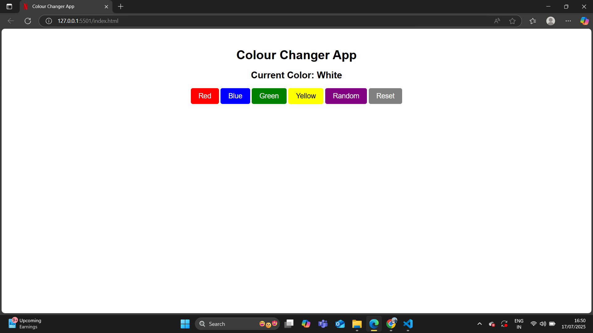

# 🎨 Color Changer App

A simple and fun application that changes the background color dynamically using **JavaScript**.  
This project demonstrates **DOM manipulation**, **Event Handling**, and **Random Color Generation**.

---

##  Features
✔ Change background color by clicking on color buttons  
✔ Random color generator button  
✔ Displays the current color name or HEX code  
✔ Reset button to set the background back to white  

---

## Technologies Used
- HTML
- CSS
- JavaScript (DOM Manipulation)

---

## Screenshot



---

##  Live Demo
[Click Here to View Live](https://jaskaransingh2121.github.io/color-changer-app/)

---

##  How to Run Locally
1. Clone this repository:
   ```bash
   git clone https://github.com/your-github-username/colourchangerapp.git
